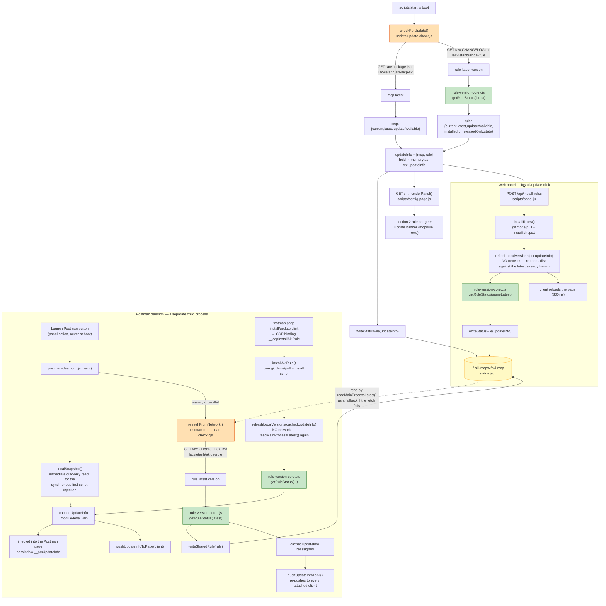

# Check-update — version-check for aki-mcp-sv and akidevrule

> updated 2026-10-01 · v2.2.0

"Checkupdate" covers **two independent version checks bundled into one pipeline**: this repo's own package (`@akinet/akimcp`, compared against `package.json` on GitHub) and the akidevrule rule corpus (compared against its `CHANGELOG.md` on GitHub). Both live in `checkForUpdate()` (`scripts/update-check.js`) and both are shown from the same `updateInfo` object — `{ mcp, rule }` — in the web panel and the Postman panel.

## Single source of truth

- **Classification core**: `scripts/rule-version-core.cjs` — the only place that parses a changelog version, compares semver, and classifies akidevrule install state (`missing`/`ahead`/`unknown`/`update`/`current`). It is `.cjs` so both the ESM web checker and the CommonJS Postman daemon can require it without a second copy.
- **Network fetch**: `scripts/rule-version-core.cjs`'s `fetchLatestRuleVersion()` is the one implementation that asks GitHub for akidevrule's latest version. Two trigger points call it — the main server at boot, and the Postman daemon once per its own start (each "Launch Postman" click) — never a third copy.
- **Shared state file**: `~/.aki/mcpsv/aki-mcp-status.json` (`STATUS_PATH`) is what both processes write and read `latest` through — whichever ran most recently wins, and the other side picks up the fresher value on its next disk read.

## Lifecycle

Green nodes = the one shared classification core (`rule-version-core.cjs`). Orange = the two places that make a real network call, both through the one shared `fetchLatestRuleVersion()`. Blue = reading the shared status file instead of the network.

## When a NEW network check runs (vs. a disk-only re-classification)

| Trigger | What runs | Network call? | Where |
|---|---|---|---|
| Main process boot (`npm start`) | `checkForUpdate()` — fetches both `mcp.latest` and `rule.latest` from GitHub | **Yes** | `scripts/start.js:157` |
| Web panel "Install / update" click (`POST /api/install-rules`) | `installRules()` then `refreshLocalVersions(ctx.updateInfo)` | No — reuses the `latest` already in `ctx.updateInfo` | `scripts/panel.js:223-227` |
| Web panel "Merge upstream" click (`POST /api/pull-update`, this repo's own code) | If an `upstream` remote exists: `git fetch upstream main` then `git merge --no-edit upstream/main`; otherwise `git pull --ff-only` | No version check at all; the running process keeps the current code until AKIMCP is restarted | `scripts/panel.js` `pullUpdate()` |
| Postman daemon launch (clicking "Launch Postman" in the panel) | `localSnapshot()` for the immediate page injection, then async `refreshFromNetwork()` — fetches, writes `STATUS_PATH`, reassigns `cachedUpdateInfo`, pushes to every attached client | **Yes** — same `fetchLatestRuleVersion()` as boot | `scripts/postman/postman-daemon.cjs` `main()` → `postman-rule-update-check.cjs` |
| Postman injected page "Install/update" click | `installAkiRule()` then `refreshLocalVersions(cachedUpdateInfo)` | No — same status-file read | `scripts/postman/postman-daemon.cjs:361-366` |

**There is no periodic/interval/cron re-check.** Both network triggers above are one-shot, each per its own process's start (main-process boot, Postman daemon launch) — not on a timer. The `mcp`/`rule` "latest" values are frozen for the lifetime of each process between those triggers; the way to learn about a newer release is either restarting `npm start` or clicking "Launch Postman" again. The install-click rows only re-check **local install state** against the already-known `latest` — never a new GitHub round-trip.

## Known duplication not covered by this doc

`installAkiRule()` (`scripts/postman/postman-daemon.cjs`) and `installRules()` (`scripts/panel.js`) are two independent, near-identical implementations of "clone/pull akidevrule + run its installer" — unlike the version-*check* logic above, this install *action* was never merged into one SSoT. Out of scope here; flagged for a future pass.

## Related

- `docs/research/repo-architecture-subtraction-inventory.md` — Amendments (2026-09-27): the version-check duplication this doc describes as fixed.
- `docs/plan/done/update-check-notify.md` — original 1.6.0 feature (dual update-check, status file, staleness self-check).
- `docs/plan/done/2.0.0-improve.md` §1 — status file path migration to `~/.aki/mcpsv/`.
